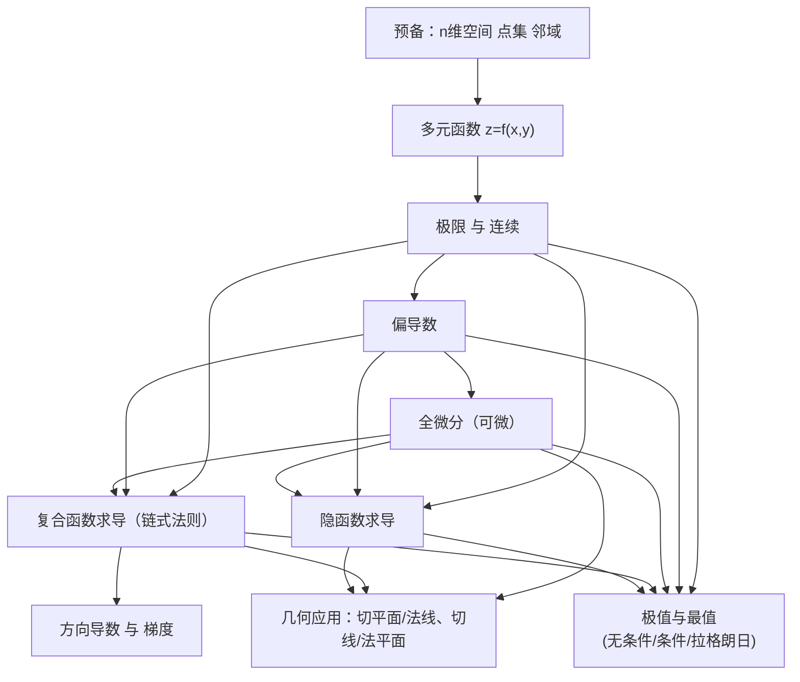
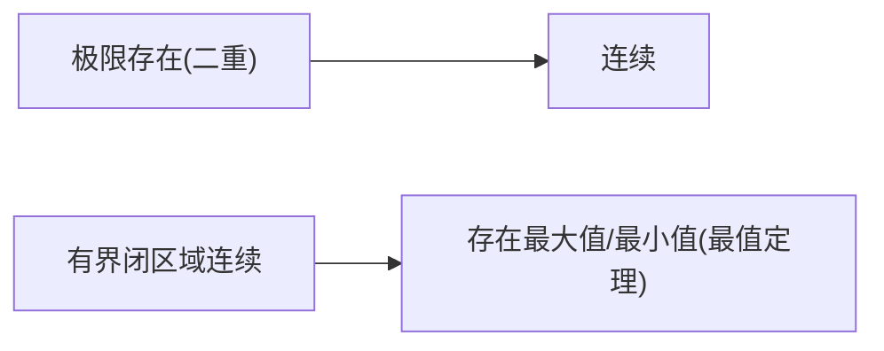
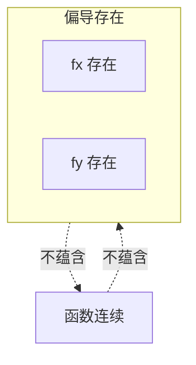
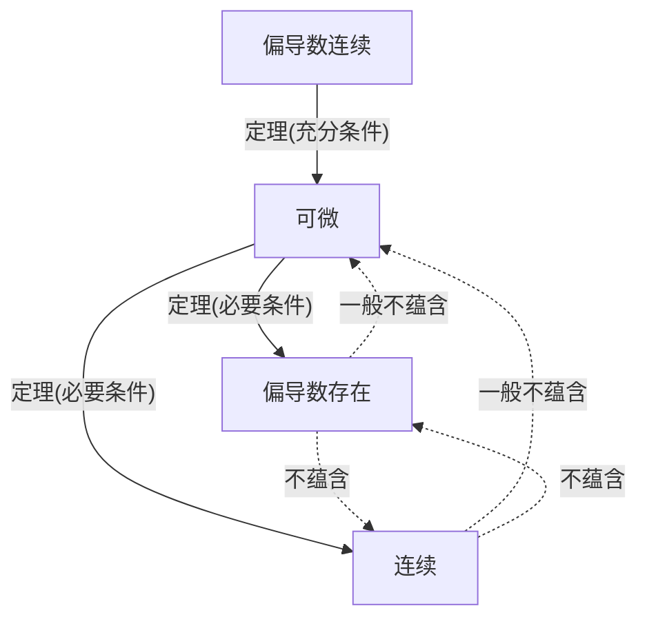
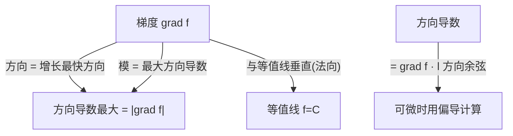
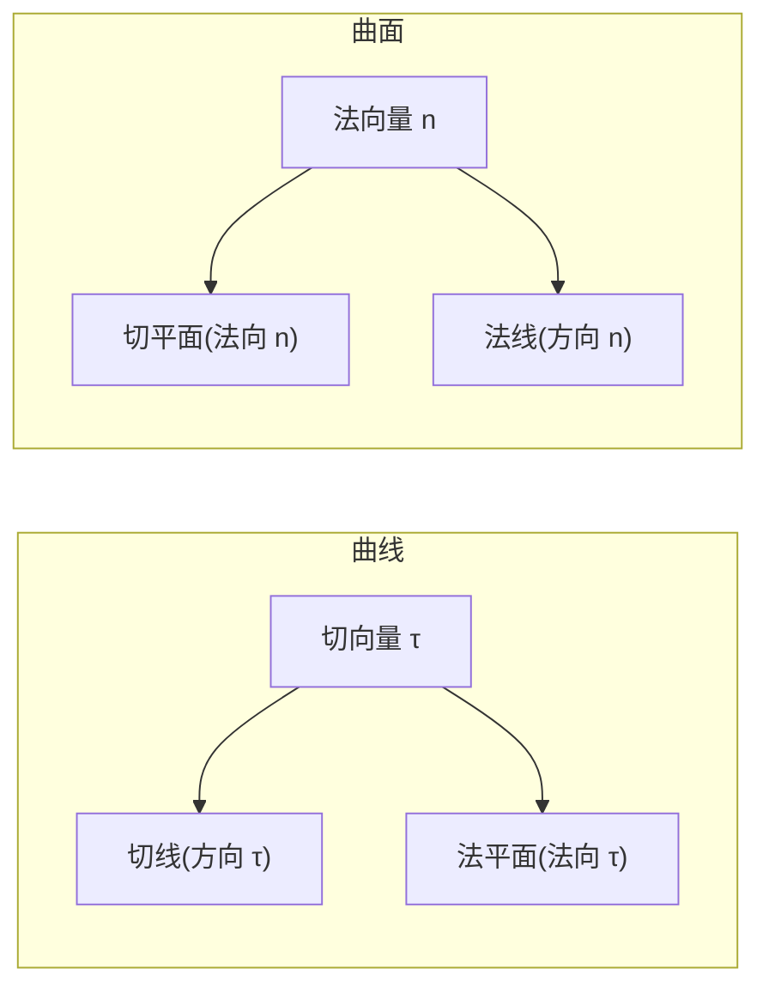
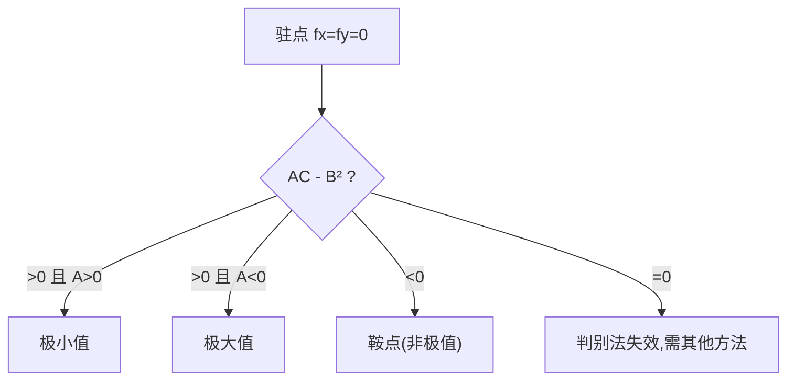
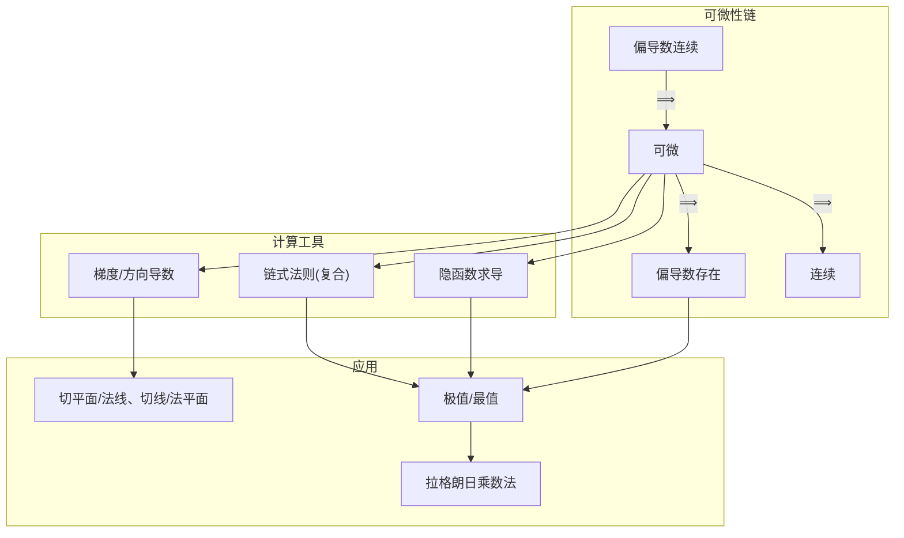

# 多元函数微分学及其应用 —— 详细笔记

> 适用对象：高等数学（多元函数微分学）复习 / 考研数学一、二基础
> 核心目标：把**概念的定义**、**概念之间的蕴含/不蕴含关系**、**计算方法**和**几何应用**讲透，并给出易错点与判断路径。

---

## 0. 知识地图（先看整体，再进细节）

整章内容可划分为「**概念层** → **求导工具层** → **应用层**」三层结构，各层之间层层递进：



**一句话主线**：先建立"多元函数"这个对象，再定义它的**极限与连续**，进而用**偏导数**和**全微分**刻画它在一点的变化率与近似性，然后用**链式法则 / 隐函数求导**扩展求导能力，最后把导数工具用到**方向导数/梯度**、**几何（切线与切平面）**和**极值最值**三大应用上。

---

## 1. 预备知识：空间点集与多元函数

### 1.1 n 维空间 $\mathbb{R}^n$ 与点集

**n 维空间** $\mathbb{R}^n$：所有 n 元有序实数组 $(x_1,x_2,\dots,x_n)$ 的集合。当 $n=2$ 时即平面 $\mathbb{R}^2$，$n=3$ 时为空间 $\mathbb{R}^3$。

**距离**：两点 $P=(x_1,\dots,x_n), Q=(y_1,\dots,y_n)$ 的欧氏距离为
$$
\rho(P,Q)=\sqrt{(x_1-y_1)^2+(x_2-y_2)^2+\cdots+(x_n-y_n)^2}.
$$

**邻域**（核心概念，后续极限定义的基础）：
- **邻域**：$U(P_0,\delta)=\{P \mid \rho(P,P_0)<\delta\}$，即以 $P_0$ 为中心、$\delta$ 为半径的**开球**（不含边界）。
- **去心邻域**：$\mathring{U}(P_0,\delta)=\{P \mid 0<\rho(P,P_0)<\delta\}$，即挖去中心点 $P_0$ 本身。

**点集分类**（一个点相对集合 $E$ 的位置）：

| 名称 | 定义（直观） |
|---|---|
| 内点 | 存在某邻域完全含于 $E$ 内 |
| 外点 | 存在某邻域完全不含 $E$ 内的点 |
| 边界点 | 任意邻域都**同时**含有 $E$ 内与 $E$ 外的点 |
| 聚点 | 任意去心邻域都含有 $E$ 中的点（可属于也可不属于 $E$） |

**集合分类**：

| 名称 | 定义 |
|---|---|
| 开集 | 点集 $E$ 的每个点都是内点 |
| 闭集 | 点集 $E$ 的边界点全属于 $E$（或 $E$ 的补集是开集） |
| 有界集 | 存在某邻域 $U(O,r)$ 使 $E \subset U(O,r)$ |
| 连通集 | $E$ 内任意两点可用完全位于 $E$ 内的折线连接 |
| 开区域 | 连通的开集 |
| 闭区域 | 开区域连同它的边界 |

> 💡 **关系记忆**：区域一定是连通的；开区域=连通开集，闭区域=开区域+边界。判断有界/无界看能否被一个球罩住。

### 1.2 多元函数

**定义**：设 $D\subset\mathbb{R}^n$，若对每个 $P\in D$，按对应法则 $f$ 都有**唯一确定**的实数 $u$ 与之对应，则称 $u=f(P)$ 为定义在 $D$ 上的 **n 元函数**，$D$ 为定义域，$\{u\}$ 为值域。

- 二元函数 $z=f(x,y)$ 的**几何意义**：一张空间曲面。
- 三元函数 $u=f(x,y,z)$ 无直观几何图形，但等值面有几何意义。

---

## 2. 多元函数的极限与连续

### 2.1 二重极限（二元函数的极限）

**定义**：设函数 $z=f(x,y)$ 在去心邻域 $\mathring{U}(P_0,\delta_0)$ 内有定义，若存在常数 $A$，使对 $\forall \varepsilon>0$，$\exists \delta>0$，当 $0<\rho(P,P_0)<\delta$ 时恒有 $|f(P)-A|<\varepsilon$，则称 $A$ 为 $f$ 在 $P_0$ 处的二重极限，记作
$$
\lim_{(x,y)\to(x_0,y_0)} f(x,y)=A.
$$

### ⚠️ 与一元极限的本质区别（高频考点）

| | 一元函数 | 二元函数 |
|---|---|---|
| 逼近方式 | 只能沿数轴从左、右**两个方向** | 可沿**任意路径**（直线、抛物线、折线…）逼近 |
| 极限存在条件 | 左极限 = 右极限 | **沿所有可能路径的极限都相等** |

> 🚨 **重要结论**：只要找到**两条不同路径**，使极限值不相等，则二重极限**不存在**。这是证明极限不存在的标准手法。
>
> **典型反例**：$f(x,y)=\dfrac{xy}{x^2+y^2}$，沿 $y=kx$ 有 $\lim=\dfrac{k}{1+k^2}$ 随 $k$ 变化，故极限不存在。

### 2.2 连续性

**定义**：$\lim_{(x,y)\to(x_0,y_0)} f(x,y)=f(x_0,y_0)$，即极限值=函数值。

**性质（有界闭区域上的连续函数）**：
1. **有界性**：在 $D$ 上有界；
2. **最值定理**：在 $D$ 上必取得最大值与最小值；
3. **介值定理**：在 $D$ 上可取得介于最小值与最大值之间的任何值。

> 💡 这些性质与一元函数在闭区间上的性质完全平行，是后续"闭区域上求最值存在性"的理论依据。

### 2.3 本阶段关系小结



---

## 3. 偏导数

### 3.1 定义

对二元函数 $z=f(x,y)$，固定 $y=y_0$，只让 $x$ 变化，得一元函数 $f(x,y_0)$：

**对 x 的偏导数**
$$
f_x(x_0,y_0)=\frac{\partial z}{\partial x}\Big|_{(x_0,y_0)}=\lim_{\Delta x\to0}\frac{f(x_0+\Delta x,y_0)-f(x_0,y_0)}{\Delta x}.
$$

**对 y 的偏导数** 同理固定 $x=x_0$：
$$
f_y(x_0,y_0)=\frac{\partial z}{\partial y}\Big|_{(x_0,y_0)}=\lim_{\Delta y\to0}\frac{f(x_0,y_0+\Delta y)-f(x_0,y_0)}{\Delta y}.
$$

**几何意义**：$f_x(x_0,y_0)$ 是曲面 $z=f(x,y)$ 被平面 $y=y_0$ 截得的曲线在点 $(x_0,y_0,f(x_0,y_0))$ 处切线的斜率（对 x 轴方向的斜率）；$f_y$ 类似。

### 3.2 高阶偏导数

二阶偏导数共有四个：
$$
\frac{\partial^2 z}{\partial x^2}=f_{xx},\quad \frac{\partial^2 z}{\partial x\partial y}=f_{xy},\quad \frac{\partial^2 z}{\partial y\partial x}=f_{yx},\quad \frac{\partial^2 z}{\partial y^2}=f_{yy}.
$$

> 💡 **混合偏导相等定理**：如果二阶偏导数 $f_{xy}$ 与 $f_{yx}$ **都连续**，则 $f_{xy}=f_{yx}$（求导次序可交换）。这一条件很重要——先对 x 再对 y，与先对 y 再对 x，结果相等的充分条件是"二阶偏导连续"。

### 3.3 偏导存在与连续的关系（易错）

> 🚨 **偏导数存在 ≠ 函数连续**！
> 偏导数只反映沿 $x$ 轴方向和 $y$ 轴方向两个特定方向的变化率，它**完全不约束**其他方向。因此一个函数可以在某点偏导存在但函数不连续。
>
> **反例**：$f(x,y)=\begin{cases}\dfrac{xy}{x^2+y^2},&(x,y)\ne(0,0)\\0,&(x,y)=(0,0)\end{cases}$。在原点 $f_x(0,0)=f_y(0,0)=0$，偏导存在；但沿 $y=kx$ 的极限不存在，故不连续。



**结论**：偏导存在与连续**互不蕴含**，两者独立。

---

## 4. 全微分（可微性）

### 4.1 定义

设 $z=f(x,y)$ 在点 $(x_0,y_0)$ 的某邻域有定义，若全增量
$$
\Delta z=f(x_0+\Delta x,y_0+\Delta y)-f(x_0,y_0)
$$
可表示为
$$
\Delta z=A\Delta x+B\Delta y+o(\rho),\qquad \rho=\sqrt{(\Delta x)^2+(\Delta y)^2},
$$
其中 $A,B$ 与 $\Delta x,\Delta y$ 无关，则称 $f$ 在点 $(x_0,y_0)$ **可微**，$A\Delta x+B\Delta y$ 称为**全微分**，记作
$$
dz=A\,dx+B\,dy.
$$

> **可微的含义**：全增量能"拆成"关于 $\Delta x,\Delta y$ 的**线性主部** $A\Delta x+B\Delta y$ 加上一个比 $\rho$ 高阶的无穷小 $o(\rho)$。可微的本质是"函数在该点可用一个线性函数很好地近似"（即存在切平面）。

### 4.2 可微与偏导、连续的关系（本章最核心的关系网）



| 结论 | 方向 | 说明 |
|---|---|---|
| 可微 ⟹ 连续 | ✅ 蕴含 | 可微必连续 |
| 可微 ⟹ 偏导存在 | ✅ 蕴含 | 且 $A=f_x(x_0,y_0),\ B=f_y(x_0,y_0)$ |
| 偏导连续 ⟹ 可微 | ✅ 蕴含 | **最常用的充分条件** |
| 偏导存在 ⟹ 可微 | ❌ 不蕴含 | 偏导存在不一定可微 |
| 连续 ⟹ 可微 | ❌ 不蕴含 | 连续不一定可微 |
| 偏导存在 ⟹ 连续 | ❌ 不蕴含 | 见 3.3 反例 |
| 连续 ⟹ 偏导存在 | ❌ 不蕴含 | 连续也不一定偏导存在 |

> 🚨 **判断可微的标准流程（考研常考）**：
> 1. 先看 $f_x(x_0,y_0),f_y(x_0,y_0)$ 是否存在（必要条件，不存在则不可微）；
> 2. 若偏导存在，用充分条件：若 $f_x,f_y$ 在 $(x_0,y_0)$ 连续则**可微**；
> 3. 若偏导不连续，退回到**定义法**验证 $\lim_{\rho\to0}\dfrac{\Delta z - f_x\Delta x-f_y\Delta y}{\rho}=0$ 是否成立，成立则可微。

### 4.3 全微分的计算与近似

- 可微时：$dz=f_x(x,y)\,dx+f_y(x,y)\,dy$。
- **近似计算**：$f(x_0+\Delta x,y_0+\Delta y)\approx f(x_0,y_0)+f_x\Delta x+f_y\Delta y$（当 $\Delta x,\Delta y$ 很小时）。

---

## 5. 多元复合函数求导法则（链式法则）

### 5.1 各种复合情形

**情形一：中间变量均为一元函数**
设 $z=f(u,v)$，$u=\varphi(t), v=\psi(t)$，则（全导数）
$$
\frac{dz}{dt}=\frac{\partial z}{\partial u}\frac{du}{dt}+\frac{\partial z}{\partial v}\frac{dv}{dt}.
$$

**情形二：中间变量为二元函数**
设 $z=f(u,v)$，$u=\varphi(x,y), v=\psi(x,y)$，则
$$
\frac{\partial z}{\partial x}=\frac{\partial z}{\partial u}\frac{\partial u}{\partial x}+\frac{\partial z}{\partial v}\frac{\partial v}{\partial x},\qquad
\frac{\partial z}{\partial y}=\frac{\partial z}{\partial u}\frac{\partial u}{\partial y}+\frac{\partial z}{\partial v}\frac{\partial v}{\partial y}.
$$

> 💡 **链式法则的口诀**：看 $z$ 到自变量有几条"路径"，每条路径上各段导数**相乘**，不同路径结果**相加**。画"链式树状图"是防止漏项的最佳方法。

```
z = f(u, v)
    ├─ u ── x
    │      └─ y
    └─ v ── x
           └─ y
∂z/∂x = f_u·u_x + f_v·v_x
```

### 5.2 一阶全微分形式不变性

> 若 $z=f(u,v)$ 可微，则无论 $u,v$ 是自变量还是中间变量，都有
> $$
> dz=\frac{\partial z}{\partial u}du+\frac{\partial z}{\partial v}dv.
> $$
> 这个"形式不变性"使得我们在求全微分时可以**放心地把中间变量当成自变量处理**，是简化复合函数求微分的利器。

---

## 6. 隐函数求导

### 6.1 一个方程的情形

**定理（隐函数存在定理）**：方程 $F(x,y)=0$ 在点 $(x_0,y_0)$ 某邻域确定隐函数 $y=y(x)$，若 $F_y\neq0$，则
$$
\frac{dy}{dx}=-\frac{F_x}{F_y}.
$$

**三元情形**：$F(x,y,z)=0$ 确定 $z=z(x,y)$，若 $F_z\neq0$，则
$$
\frac{\partial z}{\partial x}=-\frac{F_x}{F_z},\qquad \frac{\partial z}{\partial y}=-\frac{F_y}{F_z}.
$$

> 💡 **记忆技巧**：对自变量求偏导时，**把另一变量当常数**，然后对 $F$ 关于该自变量求导，再除以"关于所求变量"的偏导并加负号。负号是隐函数求导的标志性特征。

### 6.2 方程组情形（两个方程）

设方程组
$$
\begin{cases}
F(x,y,u,v)=0\\
G(x,y,u,v)=0
\end{cases}
$$
确定 $u=u(x,y), v=v(x,y)$。求 $\dfrac{\partial u}{\partial x},\dfrac{\partial v}{\partial x}$ 时，**对两式分别对 $x$ 求偏导（$y$ 视为常数）**，得到关于 $\dfrac{\partial u}{\partial x},\dfrac{\partial v}{\partial x}$ 的二元线性方程组，再用**雅可比行列式**（Cramer 法则）求解：
$$
J=\frac{\partial(F,G)}{\partial(u,v)}=\begin{vmatrix}F_u&F_v\\G_u&G_v\end{vmatrix}\ne0.
$$

> 💡 求隐函数偏导的**两条路径**：① 用公式 $-\dfrac{F_x}{F_z}$；② 对等式两端直接求偏导再解出。两者结果一致，②在方程组情形更通用。

---

## 7. 方向导数与梯度

### 7.1 方向导数

**定义**：设 $l$ 为单位方向向量 $(\cos\alpha,\cos\beta)$，则 $f$ 在点 $P_0$ 沿方向 $l$ 的方向导数为
$$
\frac{\partial f}{\partial l}=\lim_{t\to0^+}\frac{f(x_0+t\cos\alpha,y_0+t\cos\beta)-f(x_0,y_0)}{t}.
$$

**计算定理**：若 $f$ 在 $P_0$ 可微，则
$$
\frac{\partial f}{\partial l}=f_x(P_0)\cos\alpha+f_y(P_0)\cos\beta.
$$
（三元类似：$f_x\cos\alpha+f_y\cos\beta+f_z\cos\gamma$。）

### 7.2 梯度

**定义**：梯度是一个**向量**，由各偏导数组成：
$$
\operatorname{grad} f = \nabla f = (f_x, f_y, f_z).
$$

### 7.3 方向导数与梯度的关系（核心结论）

$$
\frac{\partial f}{\partial l} = \nabla f \cdot (\cos\alpha,\cos\beta) = |\nabla f|\cos\theta
$$
其中 $\theta$ 为梯度与方向 $l$ 的夹角。

| 方向 | 方向导数值 | 含义 |
|---|---|---|
| 沿梯度方向 ($\theta=0$) | $|\nabla f|$（最大） | 函数增长最快 |
| 逆梯度方向 ($\theta=\pi$) | $-|\nabla f|$（最小） | 函数下降最快 |
| 垂直梯度方向 ($\theta=\pi/2$) | $0$ | 沿等值线方向，函数值不变 |



> 🚨 **易错点**：方向导数是一个**数值**（标量），梯度是一个**向量**。梯度方向是使方向导数**最大**的方向，梯度的模就是最大方向导数；梯度恒与等值线（等值面）垂直，即梯度是等值面在该点的**法向量方向**。

---

## 8. 几何应用：切线与切平面

### 8.1 空间曲线的切线与法平面

**参数式**：空间曲线 $x=\varphi(t), y=\psi(t), z=\omega(t)$ 在 $t=t_0$ 处，
- **切向量**：$\vec\tau=(\varphi'(t_0),\psi'(t_0),\omega'(t_0))$；
- **切线方程**：$\dfrac{x-x_0}{\varphi'(t_0)}=\dfrac{y-y_0}{\psi'(t_0)}=\dfrac{z-z_0}{\omega'(t_0)}$；
- **法平面方程**：$\varphi'(t_0)(x-x_0)+\psi'(t_0)(y-y_0)+\omega'(t_0)(z-z_0)=0$。

> 💡 **关系**：切线以切向量为方向；法平面以切向量为**法向量**（两者互相垂直，法平面过切点且垂直于切线）。

### 8.2 空间曲面的切平面与法线

**情形一：显式** $z=f(x,y)$。令 $F(x,y,z)=f(x,y)-z=0$，则
- **法向量**：$\vec n=(-f_x,-f_y,1)$；
- **切平面**：$f_x(x_0,y_0)(x-x_0)+f_y(x_0,y_0)(y-y_0)-(z-z_0)=0$；
- **法线**：$\dfrac{x-x_0}{f_x}=\dfrac{y-y_0}{f_y}=\dfrac{z-z_0}{-1}$。

**情形二：隐式** $F(x,y,z)=0$。
- **法向量**：$\vec n=(F_x,F_y,F_z)$；
- **切平面**：$F_x(x-x_0)+F_y(y-y_0)+F_z(z-z_0)=0$；
- **法线**：$\dfrac{x-x_0}{F_x}=\dfrac{y-y_0}{F_y}=\dfrac{z-z_0}{F_z}$。

> 💡 **关系**：切平面以法向量 $\vec n$ 为法向，法线以 $\vec n$ 为方向。**法向量 $\vec n$ 同时是切平面的法向量和法线的方向向量**——找到法向量，切平面与法线就都出来了。



---

## 9. 多元函数的极值与最值

### 9.1 无条件极值（普通极值）

**定义**：若存在 $(x_0,y_0)$ 的某邻域，使 $f(x,y)\le f(x_0,y_0)$（极大）或 $\ge$（极小），则 $(x_0,y_0)$ 为极值点。

**必要条件**：若 $f$ 在 $(x_0,y_0)$ 可导且有极值，则
$$
f_x(x_0,y_0)=0,\qquad f_y(x_0,y_0)=0.
$$
满足该条件的点称为**驻点**。

> 💡 **关系**：可导函数的极值点**必为**驻点，但驻点**不一定是**极值点（如 $f=x^2-y^2$，原点驻点却是鞍点）。

**充分条件（判别法）**：设 $(x_0,y_0)$ 为驻点，记
$$
A=f_{xx},\quad B=f_{xy},\quad C=f_{yy},\quad \Delta=AC-B^2.
$$
| 条件 | 结论 |
|---|---|
| $AC-B^2>0$ 且 $A>0$ | 极小值 |
| $AC-B^2>0$ 且 $A<0$ | 极大值 |
| $AC-B^2<0$ | 不是极值（鞍点） |
| $AC-B^2=0$ | 需另法判断（此法失效） |



### 9.2 条件极值与拉格朗日乘数法

**问题**：求 $z=f(x,y)$ 在约束条件 $\varphi(x,y)=0$ 下的极值。

**拉格朗日乘数法**：构造**拉格朗日函数**
$$
L(x,y,\lambda)=f(x,y)+\lambda\,\varphi(x,y),
$$
解方程组
$$
L_x=f_x+\lambda\varphi_x=0,\quad L_y=f_y+\lambda\varphi_y=0,\quad L_\lambda=\varphi=0,
$$
求出候选点，再结合实际问题（或高阶判断）确定极值。

> 💡 **与无条件极值的区别**：无条件极值在**全平面**上自由找；条件极值被限制在约束曲线/曲面 $\varphi=0$ 上找。几何上，条件极值发生在等值线与约束曲线**相切**处。

### 9.3 闭区域上的最值

**求最值的一般步骤**：
1. 求 $f$ 在**区域内部**的驻点及可能极值点，算出函数值；
2. 求 $f$ 在**区域边界**（一条/多条曲线）上的最值——边界上用拉格朗日乘数法或化为一元函数；
3. 比较内部与边界所有候选点的函数值，最大者为最大值，最小者为最小值。

> 💡 **关系**：最值≠极值。极值是"局部"概念（邻域内），最值是"整体"概念（闭区域上）。由于有界闭区域上连续函数必有最值（见 2.2 最值定理），所以步骤可保证存在性。

---

## 10. 全章概念关系总图 + 易错点清单

### 10.1 概念蕴含关系总图（务必熟记）



**单条箭头都是"充分/必要"的严格蕴含；没有箭头的两两之间通常不蕴含**，这是本单元最大的失分点。

### 10.2 高频易错点清单

| # | 易错点 | 正确认知 |
|---|---|---|
| 1 | 认为"偏导存在 ⟹ 连续" | ❌ 两者互不蕴含，见 3.3 反例 |
| 2 | 认为"连续 ⟹ 可微" | ❌ 可微要求更高，还需偏导存在且增量线性化成立 |
| 3 | 把梯度当成数值 | ❌ 梯度是向量；方向导数才是数值 |
| 4 | 梯度方向记反 | 梯度指向**增长最快**方向，且垂直等值线 |
| 5 | 驻点当极值点 | ❌ 需用 $AC-B^2$ 判别法，鞍点不是极值点 |
| 6 | 条件极值只求驻点 | 条件极值用拉格朗日乘数法，别与无条件极值混用 |
| 7 | 混合偏导随便交换次序 | 需 $f_{xy},f_{yx}$ 连续才可交换 |
| 8 | 二重极限只看一两条路径 | 极限存在要求**所有路径**极限相等 |
| 9 | 切线/法平面、切平面/法线混淆 | 记住"切向量 τ ↔ 法平面"、"法向量 n ↔ 切平面"配对 |

---

## 11. 一份可对照的"概念定义速查表"

| 概念 | 数学定义 | 一句话本质 |
|---|---|---|
| 邻域 | $\{P\mid\rho(P,P_0)<\delta\}$ | 中心的 $\delta$-开球 |
| 二重极限 | $\lim_{P\to P_0}f(P)=A$ | 所有路径逼近都趋于 $A$ |
| 连续 | $\lim_{P\to P_0}f(P)=f(P_0)$ | 极限值=函数值 |
| 偏导数 | $f_x=\lim_{\Delta x\to0}\frac{f(x_0+\Delta x,y_0)-f(x_0,y_0)}{\Delta x}$ | 单方向（沿坐标轴）变化率 |
| 全微分 | $dz=f_xdx+f_ydy$ | 增量的线性主部（可微性） |
| 梯度 | $\nabla f=(f_x,f_y,f_z)$ | 增长最快方向的向量 |
| 方向导数 | $f_l=f_x\cos\alpha+f_y\cos\beta$ | 沿方向 $l$ 的变化率 |
| 驻点 | $f_x=f_y=0$ | 可能极值点（未必是） |
| 拉格朗日函数 | $L=f+\lambda\varphi$ | 把约束并入目标函数 |

---

*文档完。建议配合教材例题反复演练链式法则、隐函数求导与 $AC-B^2$ 判别法三类计算题，这三类是本章最常考的计算型题目。*
